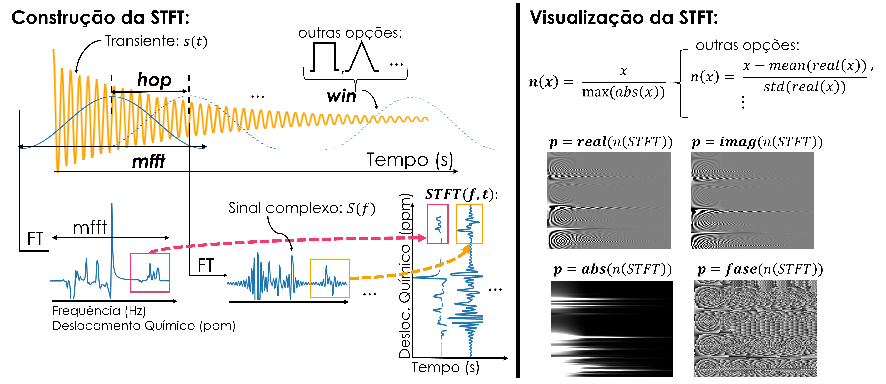
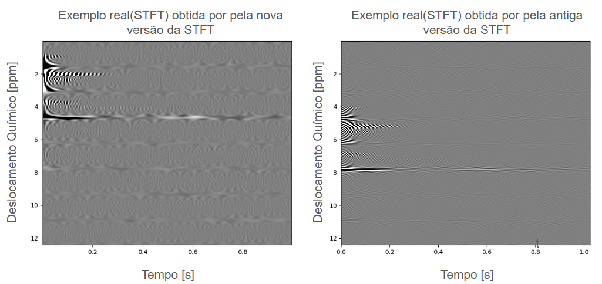
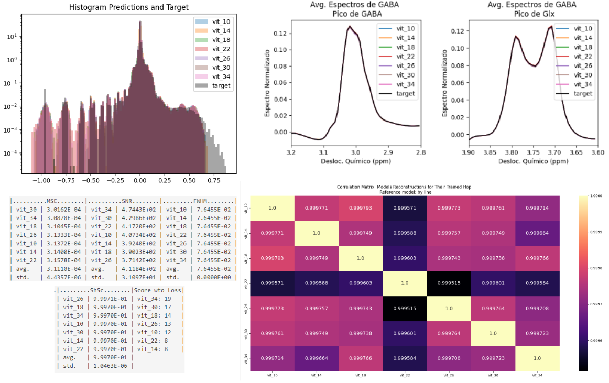

[](https://github.com/MICLab-Unicamp/Spectro-ViT) [](https://doi.org/10.1016/j.mri.2024.110219)


# Explorando o Comportamento do SpectroVit em Dados Simulados e Variando os Parâmetros de Geração do Espectrograma 

Este repositório contém experimentos realizados para o projeto de iniciação científica entitulado: **Espectroscopia por ressonância magnética (MRS) para quantificação GABA: compreendendo a representação por espectrograma para aperfeiçoar o treinamento de um modelo de reconstrução baseado em Deep-Learning**, realizado no laboratório **Medical Image Computing Lab (MICLab)** da **Faculdade de Engenharia Elétrica e de Computação (FEEC)** com financiamento da **FAPESP** (projeto: 2024/01294-2).

Orientadora: Letícia Rittner

Orientanda: Letícia Diniz

Resumo do projeto: O Ácido Gama-aminobutírico (GABA) é o principal neurotransmissor inibitório do sistema nervoso e deficiências nos níveis de GABA estão associadas a síndromes psiquiátricas, tais como a depressão. Dada sua importância, existe interesse em quantificar a concentração de GABA *in vivo*. Para tal, utiliza-se a técnica de espectroscopia por ressonância magnética (MRS), na qual múltiplos transientes de GABA são adquiridos e seus espectros analisados. O problema dessa técnica é que ela exige aquisições demoradas e desconfortáveis para o paciente. O modelo de *Deep-Learning* [SpectroVit](https://pubmed.ncbi.nlm.nih.gov/39069027/) foi proposto com o intuito de acelerar as aquisições, gerando espectros de alta qualidade a partir do espectrograma de uma quantidade limitada de transientes de GABA. O espectrograma é uma representação bidimensional que carrega informações temporais e frequenciais sobre o sinal de origem, e não é normalmente usado no contexto de MRS. O espectrograma é obtido através da Transformada de Fourier de Curto Tempo (STFT), a qual utiliza uma técnica de janelamento do sinal. Este estudo se propôs a investigar a representação por espectrograma de transientes de GABA, visando entender como tal representação se altera dependendo das escolhas de parâmetros da STFT (tamanho, passo e formato de janela e normalização da imagem) e da característica do sinal original (diferentes níveis de ruído). Também investigou-se como a variação do passo de janela afeta a performance do SpectroVit. Para a caracterização do espectrograma de GABA considera-se observações qualitativas apoiadas de métricas quantitativas. Este trabalho contribui para o entendimento dessa nova representação para transientes de GABA que é o objeto de entrada do SpectroVit, contribuindo assim para a explicabilidade do modelo e aceitação em meio clínico.

## Contexto

Sinais de espectroscopia por ressonância magnétrica são adquiridos no domínio do tempo e analisados no domínio da frequência através da Transformada de Fourier (FT). Quando no domínio do tempo, refere-se a transientes ou sinais FID, no domínio da frequência refere-se a espectros. Uma outra representação possível para tais sinais é a representação pela Transformada de Fourier de Curto Tempo (STFT), a qual transforma o sinal em uma função de duas variáveis: o tempo e a frequência. Essa representação, no entanto, não é muito usual no contexto de espectroscopia para quantificação do neurotransmissor GABA. Apesar disso, seu uso foi proposto como objeto de entrada de um modelo de reconstrução de espectro de GABA - [SpectroVit](https://pubmed.ncbi.nlm.nih.gov/39069027/) - e os resultados positivos geraram interesse nesse tipo de representação. 

A STFT é interessante, pois ela carrega informações frequenciais e temporais de um sinal. Além disso, apesar de ser uma função no domínio dos números complexos, quando apenas uma componente é selecionada (parte real, parte imaginária, magnitude ou fase), pode-se visualizar a STFT como uma imagem que contém na direção horizontal o eixo do tempo, na direção vertical o eixo das frequências, e a intensidade dos pixels correspondendo a amplitude da componente da STFT para um par (instante,frequência). Ao tratar-se da STFT como uma imagem, pode-se utilizar das vastas ferramentas de tratamento de imagens (clássicas e baseadas em IA) para extrair informações da mesma.

A construção da STFT depende de uma janela que percorre o sinal no tempo e em cada posição realiza a FT do sinal englobado (Fig. 1). O passo, tamanho e formato da janela são parâmetros dessa função, e referidos neste trabalho como *hop*,*mfft* e *win*, respectivamente. Além disso, para a visualização da STFT a normalização da função (*norm*) e a componente visualizada (*p*) também são parâmetros importantes. Neste trabalho, visto o interesse na utilização da STFT para representar sinais FID de GABA, busca-se caracterizar como a variação dos parâmetros da STFT e as propriedades do sinal no tempo afetam a imagem visualizada. Além disso, busca-se caracterizar como a variação dos parâmetros da STFT afetam a performance do SpectroVit para dados reais e simulados.



Figura 1: Descrição dos parâmetros de construção e de visualização da STFT.

Neste repositório, apresenta-se apenas os documentos relacionados a caracterização do SpectroVit em função dos parâmetros da STFT, em particular, da variação do parâmetro *hop*. O desenvolvimento deste estudo parte do [repositório que propõem o SpectroVit](https://github.com/MICLab-Unicamp/Spectro-ViT), e o modifica para lidar com dados sintéticos - acesso e manipulação mais fácil - e para comparar modelos treinados utilizando diferentes valores de *hop*.

Ao leitor interessado na caracterização da STFT com relação a seus parâmetros de geração e nível de ruído dos transientes, refere-se ao [repositório do estudo](https://github.com/MICLab-Unicamp/LeticiaDiniz_IC). 

Os dados simulados utilizados neste trabalho correspondeme a transientes GABA-editados simulados disponibilizados pelo desafio [Edited-MRS Reconstruction Challenge](https://sites.google.com/view/edited-mrs-rec-challenge/home). Dados reais de transientes GABA-editados podem ser encontrados no dataset público [Big GABA](https://www.nitrc.org/projects/biggaba/). Tais dados foram utilizados para o desenvolvimento original do SpectroVit, conforme sugere a [publicação](https://pubmed.ncbi.nlm.nih.gov/39069027/) do mesmo.

Ao leitor interessado no contexto, dados e maiores explicações da metodologia do trabalho sugere-se leitura da publicação parcial do trabalho: [Resumo Apresentado no XXXII Congresso de Iniciação Científica da UNICAMP](https://prp.unicamp.br/inscricao-congresso/resumos/2024P23809A32091O2964.pdf)

**Observação:** Normalmente, utiliza-se o termo "espectrograma" para referir-se a imagem obtida da visualização da magnitude da STFT em escala logarítmica. No entanto, por coerência com a terminologia utilizada na publicação do [SpectroVit](https://pubmed.ncbi.nlm.nih.gov/39069027/), neste repositório refere-se a "espectrograma" de modo mais amplo, usando o termo como o entendimento da STFT como uma imagem. Como, no geral, em espectroscopia utiliza-se apenas a parte real da FT para definir o que se chama de espectro, aqui o termo "espectrograma de GABA" refere-se a imagem obtida da visualização da parte real da STFT (*p* = parte real). No restante deste documento, assume-se a nomenclatura aqui apresentada.

## Descrição do Repositório

Esse repositório é uma extensão do [repositório que propõem o SpectroVit](https://github.com/MICLab-Unicamp/Spectro-ViT) que contém o framework para treino e validação do [SpectroVit](https://pubmed.ncbi.nlm.nih.gov/39069027/). 

Principais modificações presentes nesse repositório:

- [Datasets](datasets.py): Adição de cinco novos tipos de Datasets para lidar com dados simulados e reais em diferentes formatos. Além disso, a implementação original do [SpectroVit](https://pubmed.ncbi.nlm.nih.gov/39069027/) considera uma versão [desatualizada da STFT](https://docs.scipy.org/doc/scipy/reference/generated/scipy.signal.stft.html). Nesse repositório há datasets adaptados para usarem a [nova versão da STFT](https://docs.scipy.org/doc/scipy/reference/generated/scipy.signal.ShortTimeFFT.html#scipy.signal.ShortTimeFFT) e a versão antiga. Nota-se que há diferenças importantes na aparência do espectrograma de GABA a depender da escolha da versão da STFT (Fig. 2). A estrutura esperada dos dados para cada tipo de dataset está descrita na Seção [Descrição de Dados](#descricao-de-dados).

- [Run SpectroVit Train](run_spectrovit_train.py): Na implementação original, o script para treinar versões do SpectroVit corresponde ao arquivo [main.py](main.py). Nessa implementação alternativa, as funções correspondentes aos loops de treino e validação estão definidas no script [main_functions_adapted.py](main_functions_adapted.py), e o script principal que define as propriedades do treino e chama as funções citadas anteriormente corresponde ao arquivo [run_spectrovit_train.py](run_spectrovit_train.py). Tal script recebe um arquivo YAML com a definição do treino. A forma esperada do arquivo YAML está descrita na Seção [Definição do Treino](#definicao-do-treino).

- [Compare Trained Models](compare_trained_models.py): Esse script contém a comparação de performance de modelos treinados com diferentes valores de *hop*. Tal comparação envolve métricas quantitativas - as mesmas utilizadas no artigo do [SpectroVit](https://pubmed.ncbi.nlm.nih.gov/39069027/) -, métricas estatísticas e exposições qualitativas (Fig. 3). É possível comparar modelos considerando testes que utilizam os valores de *hop* corretos para os quais cada modelo foi treinado, bem como comparar a performance de cada modelo em diferentes valores de *hop* para compreender a capacidade de cada um de se generalizar para entradas com características diferentes. Esse script também recebe um arquivo YAML como entrada para definição dos testes e comparações a serem realizadas. A forma esperada do arquivo YAML está descrita na Seção [Definição do Teste de Modelos Treinados com Diferentes Hops](#definicao-do-teste-de-modelos-treinados-com-diferentes-hops).



Figura 2: Exemplo de espectrogramas de GABA adquiridos pela versão nova e antiga da STFT. Versão antiga utilizada na implementação original do SpectroVit.



Figura 3: Exemplos de comparações entre modelos treinados com diferentes hops obtidas pelo script de teste.

## Descrição de Dados

O dataset original **DatasetThreeChannelSpectrogram**, e o dataset que utiliza uma versão nova da STFT **DatasetRealDataSeparateFiles**, esperam receber o caminho para uma pasta com dados organizados em arquivos HDF5 contendo os seguintes elementos:

- **transient_specs**: Numpy array com formato (nmr de pontos, sub-transientes, nmr de transientes). Sub-transientes são os transientes off (axis 0) e on (axis 1) GABA editados. Nmr de transientes esperado é 40.
- **target_spectra**: Numpy array contendo o espectro alvo com formato (nmr de pontos).
- **ppm**: Numpy array contendo o deslocamento químico em ppm com formato (nmr de pontos). Esse array constitui o eixo horizontal do espectro.
- **fs**: Frequência de amostragem dos transientes (float64).
- **tacq**: Tempo de aquisição dos transientes (float64).
- **larmorfreq**: Frequência de Larmor da acquisição dos transientes (float64).

Os datasets criados para lidar com dados sintéticos **DatasetSpgramSyntheticData** e **DatasetSpgramSyntheticDataOldSTFT** esperam receber o caminho para um único arquivo HDF5 contendo os seguintes elementos:

- **ground_truth_fids**/**corrupted_fids**: Numpy array com formato (N, nmr de pontos, sub-transientes) se **ground_truth_fids** ou  (N, nmr de pontos, sub-transientes, nmr de transientes) se **corrupted_fids**. N corresponde a simulações diferentes. Quando **corrupted_fids**, espera-se nmr de transientes igual a 40. Para o caso de **ground_truth_fids**, a definição do dataset permite a criação de transientes ruidosos que transformam o formato do array par ao mesmo de **corrupted_fids**. Isto é, durante o treino pode-se realizar data augmentation a partir de transientes sem ruído.
- **spectrum**: Numpy array contendo o espectro alvo com formato (N, nmr de pontos) -> APENAS SE os transientes são ruidosos - **corrupted_fids** -, senão o espectro alvo é criado pela própria chamada do dataset que utiliza os transientes sem ruído **ground_truth_fids**.
- **ppm**: Numpy array contendo o deslocamento químico em ppm com formato (N, nmr de pontos). Esse array constitui o eixo horizontal do espectro.
- **t**: Numpy array contendo o eixo do tempo dos transientes com formato (N, nmr de pontos).

Os datasets criados para lidar com dados reais provindos do desafio [Edited-MRS Reconstruction Challenge](https://sites.google.com/view/edited-mrs-rec-challenge/home), **DatasetSpgramRealData** e **DatasetSpgramRealDataOldSTFT**, esperam receber o caminho para um único arquivo HDF5 contendo os seguintes elementos:

- **transient_fids**: Numpy array com formato (N, nmr de pontos, sub-transientes, nmr de transientes). Nmr de transientes esperado é 40 ou 320, a depender deseja-se realizar data augmentation pela recombinação e amostragem de transientes. 
- **target_spectra**: Numpy array contendo o espectro alvo com formato (N, nmr de pontos).
- **ppm**: Numpy array contendo o deslocamento químico em ppm com formato (N, nmr de pontos). Esse array constitui o eixo horizontal do espectro.
- **t**: Numpy array contendo o eixo do tempo dos transientes com formato (N, nmr de pontos).

Para maiores explicações checar [Datasets](datasets.py).

## Definição do Treino

Para realizar o treino do SpectroVit com as adaptações propostas nesse repositório, utiliza-se o script [run_spectrovit_train.py](run_spectrovit_train.py). O usuário será requisitado entrar o caminho para um arquivo YAML com as configurações do treino.

O arquivo deve conter as seguintes informações:

```yaml
model:
  name_model: "string with model name"
  dir_save_results: "path to folder to be created" #default: "../name_model/"
  new_model: True/False #if True, creates results folder, else no folder is created, but path_to_save_model is required
  path_to_saved_model: "" #empty string if new_model = True, else should contain string with path to saved model folder

data:
  data_folder: "string with path to data (folder or file)"
  start_point_train_data: int or None
  end_point_train_data: int or None
  augment_with_noise_train: True/False #if True adds noise to transients
  augment_with_idx_repetition_train: True/False #if True repeat transients to augment data - this works differntly depending if we are working with synthetic or real data - check datasets.py
  qntty_to_augment_by_idx_train: int #if augment_with_idx_repetition_train=True, the amount of times we repeat each transient
  start_point_validation_data: int or None
  end_point_validation_data: int or None
  augment_with_noise_validation: True/False #if True adds noise to transients
  augment_with_idx_repetition_validation: True/False #if True repeat transients to augment data - this works differntly depending if we are working with synthetic or real data - check datasets.py
  hop_size: int
  random_augment: #noise configuration, can also repeat this structure for phase and frequency noise
      amplitude:
        noise_level_base:
          max: float
          min: float
        noise_level_scan_var:
          max: float
          min: float
      
dataset: "string with dataset class name" #should be one of strings present in constants.py

training:
  batch_size_train: int
  batch_size_validation: int
  n_epochs: int

loss: "string with loss class name" #should be one of strings present in constants.py

optimizer:
  Adam: #or SGD
    lr: float
  path_to_saved_optimizer: "" #if new_model=False, should contain a string with path to saved optimizer

lr_scheduler:
  activate: True/False
  path_to_saved_scheduler: "" #if new_model=False, should contain a string with path to save lr scheduler
  scheduler_type: "string with scheduler name" #should be one of strings present in lr_scheduler.py
  epoch_to_switch_to_lr_scheduler: int #epoch to start using lr scheduler
  initial_lr_scheduler: float 
  info: #extra args if desired lr scheduler has additional parameters
  
save_models_and_results:
  step_to_safe_save_models: int #every step_to_safe_save_models epochs save model, optimizer and lr_scheduler to resume train in case of power loss
  step_for_saving_plots: int #every step_for_saving_plots epochs save predictions plots to show training evolution
  save_best_model: True/False #if True, saves last epoch model as well as model that best performed in a pre-defined criteria

wandb:
  activate: True/False
```
Checar exemplos de arquivos YAML: [para dados sintéticos](configs/config_synth.yaml), [para dados reais em arquivo HDF5 único](configs/config_real.yaml) e [para dados reais em arquivos HDF5 distintos](configs/config_real_spvit_separate.yaml).

Para maiores explicações checar [run_spectrovit_train.py](run_spectrovit_train.py) e [main_functions_adapted.py](main_functions_adapted.py).

## Definição do Teste de Modelos Treinados com Diferentes Hops

Para realizar a comparação de diferentes versões do SpectroVit treinadas com diferentes *hop*s, utiliza-se o script [compare_trained_models.py](compare_trained_models.py). O usuário será requisitado entrar o caminho para um arquivo YAML com as configurações do teste.

```yaml
device: 'device to run test' #cpu or cuda

test_name: 'test name that will be the name of results folder'

test_dataset:
  path: 'path to file with test data'
  type: "string with dataset class name" #should be one of strings present in constants.py - not adapted yet to Datasets that work with separate files

hop_values: list with hop values

model_names: list with paths to models (pt files)

model_nicknames: list with strings with nicknames for models (in order) #suggestion: keep nicknames under 6 characters

show_results_for_each_hop: True/False #evaluate every model in every hop value
show_results_for_all_hops_combined: True/False #save figures for this complete evaluation
```
Checar exemplo de arquivos YAML: [para modelos treinados com dados sintéticos](configs/config_eval.yaml).

Para maiores explicações checar [compare_trained_models.py](compare_trained_models.py) e [utils_for_evaluation.py](utils_for_evaluation.py).

## Créditos

- Esse repositório se apropria do código e estudo promovido no [repositório do SpectroVit](https://github.com/MICLab-Unicamp/Spectro-ViT).

- Esse estudo utilizou dados obtidos do desafio [Edited-MRS Reconstruction Challenge](https://sites.google.com/view/edited-mrs-rec-challenge/home). 

- Este estudo utilizou dados reais obtidos do dataset [Big GABA](https://www.nitrc.org/projects/biggaba/) ([Publication](https://pubmed.ncbi.nlm.nih.gov/28716717/)).

- O script de Data Augmentation foi adaptado do repositório do desafio [Edited-MRS Reconstruction Challenge](https://github.com/rmsouza01/Edited-MRS-challenge).
